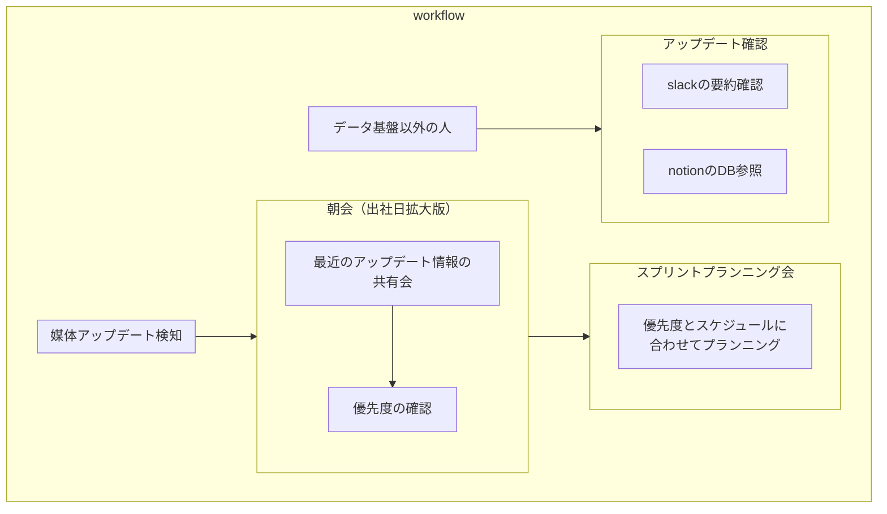
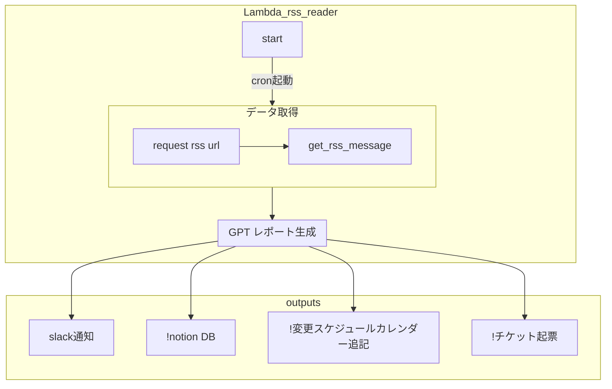

# システム概要

## 目的

媒体 API のアップデート情報を取得し、GPT を活用して日本語レポートとしてまとめたい。

## ユースケース

1. 媒体アップデート情報を早めに検知し、プロダクト影響があるのかを検知したい。
1. 媒体 API の変更による修正対応を迅速にするため。

## 運用イメージ

### ワークフロー

### システムフロー

!は発展系

## .env について

| key            | description                              | 備考                                      |
| -------------- | ---------------------------------------- | ----------------------------------------- |
| OPENAI_API_KEY | OpenAI へのリクエストに必要になる APIkey | 現状開発者（林田）の自前の API key を利用 |
